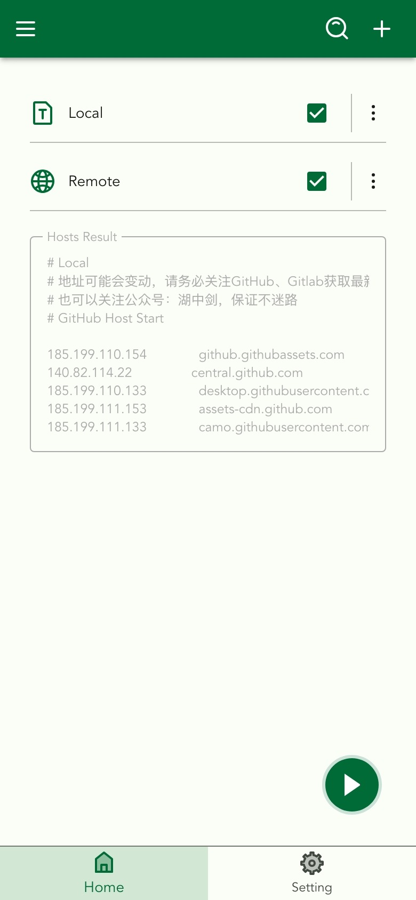
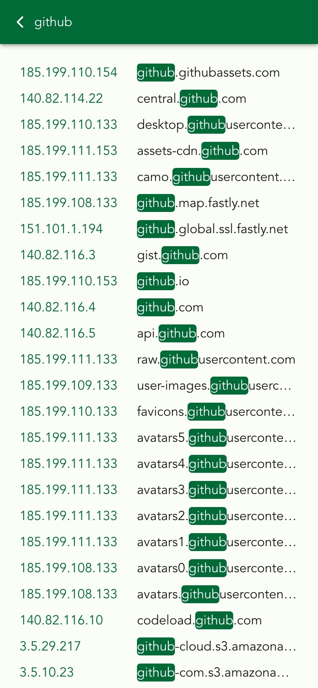
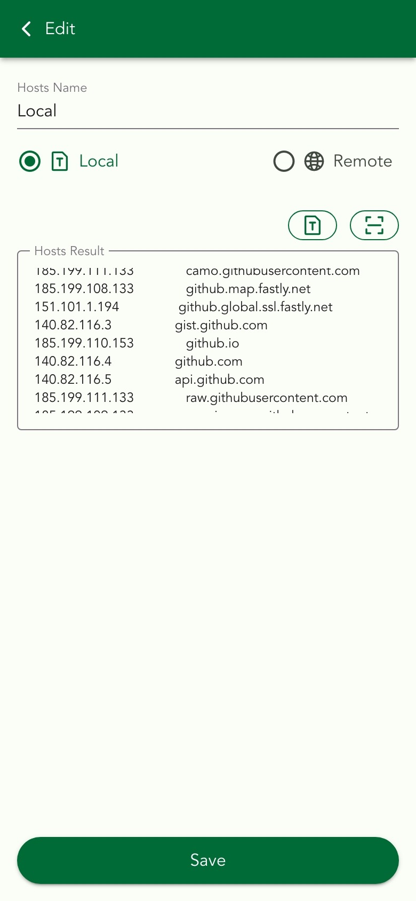
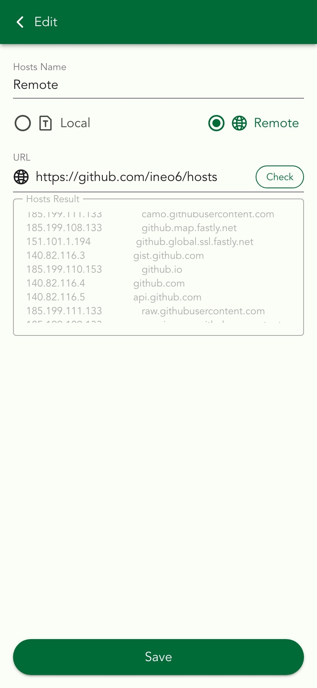

## virtual-switch-hosts

A lightweight hosts proxy tool based on Rust, which allows users to easily switch hosts files without obtaining root permissions.

<!-- TODO 替换链接 -->

## Features

1. No Root
2. Local hosts form file
3. Local hosts form QrCode
4. Local hosts form input
5. Remote hosts
6. Search hosts

## screenshots

   
    
